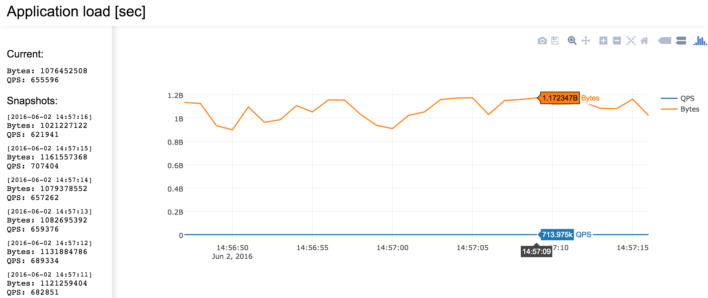

# Easy-metrics [![GoDoc] (https://godoc.org/github.com/admobi/easy-metrics?status.svg)](https://godoc.org/github.com/admobi/easy-metrics) [](https://goreportcard.com/report/github.com/admobi/easy-metrics) [](https://travis-ci.org/admobi/easy-metrics) [](https://coveralls.io/github/admobi/easy-metrics?branch=master)
A Go library that provides easy to use, standalone metrics and exposes it via HTTP.
It provides metrics snapshots on defined interval and stores it in a pool.
That can be used to track performance and other application indicators without necessity of export into external applications.

# Features
Metrics can be stored in a `TrackRegistry` that provides snapshots over defined interval and stores it in a pool. Snapshots like other metrics available via HTTP.
So you don't need to collect metrics in some external applications like statsd, graphana, elk etc.

# Installation
Just go get:
```
go get github.com/admobi/easy-metrics
```

Or to update:
``` 
go get -u github.com/admobi/easy-metrics
```

# Usage
At the core of metrics is two subjects, *metric* which stores a single numerical value
and *registry* which stores pool of metrics.

Add import to project:
```go
import "github.com/admobi/easy-metrics"
```

Create and update metrics:
```go
// Create metrics
c := mertics.NewCounter("requests")
g := mertics.NewGauge("rates")
// Create registry
r, err := metrics.NewRegistry("Statistics")
// Register metrics
r.AddMetrics(c, g)

// Change metric. Increase by 1 
c.Inc()
// or the same
c.Add(1)

// Add delta to gauge
g.Add(3.14)
```

All operations are thread safe.

## Snapshots
```go
r := metrics.NewTrackRegistry("Stat", 30, time.Second, false)
c := mertics.NewCounter("requests")
r.AddMetrics(c)
```

In this case TrackRegistry will take metric snapshots every second and stores last 30 results.
For largest interval you may align timer by setting `align` to `true` . For example:
```go
r := metrics.NewTrackRegistry("Stat", 30, time.Hour, true)
```
If application starts at 11:15, snapshots will be created at 12:00, 13:00 etc. (not 12:15, 13:15)

## Monitoring
Add 
```go
go func() {
		log.Println(http.ListenAndServe(":9911", nil))
}()
```

And then go to `http://localhost:9911/easy-metrics`. You'll see the list of registries. Chose one and you should see something like that:


It uses [Plotly](https://github.com/plotly/plotly.js) library for charts.

# Contribution
Contributions are welcome. Feel free to create issue or better PR :)

# License
MIT License